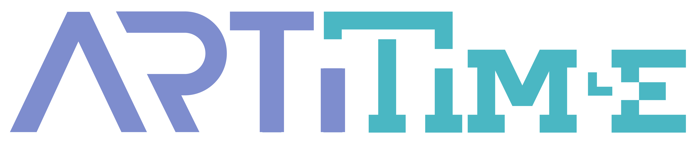

# ArtiTime smart contracts

* _Standart_        : [ERC20](https://github.com/ethereum/EIPs/blob/master/EIPS/eip-20.md)
* _[Name](https://github.com/ethereum/EIPs/blob/master/EIPS/eip-20.md#name)_                : ArtiTime
* _[Ticker](https://github.com/ethereum/EIPs/blob/master/EIPS/eip-20.md#symbol)_            : ARTI
* _[Decimals](https://github.com/ethereum/EIPs/blob/master/EIPS/eip-20.md#decimals)_        : 18
* _Emission_        : One-time, 1 000 000 000 tokens
* _Fiat dependency_ : No
* _Token offers_    : 3
* _Token locks_     : Yes

## Smart contracts description

ArtiTime smart-contract

### Contracts
1. _Configurator_ - Entry point for deployment
2. _ArtiTimeToken_ - Token contract
3. _Sale_ - Sale contract
4. _VestingWallet_ - Token lock contract with vesting schedule

### Token distribution
1. _Marketing_: 60 000 000
2. _Celebrity support_: 25 000 000
3. _Team_: 75 000 000
4. _Developers_: 75 000 000
5. _Sales_: 321 570 000

### How to work with this project
#### To start working with the contracts, please, follow theese steps for each contract:
1. Compile the contract using Remix with `enable optimization` flag and `compiler version` set to `0.8.0`.
2. Copy `.env.example` to `.env` and fill in the parameters.
2. Deploy the contract using deployment script:  
   ```truffle exec scripts/1_deploy_configurator.js --network NetworkName```  
   for example:  
   ```truffle exec scripts/1_deploy_configurator.js --network ropsten```
3. After deployment, run the following command with one or more contracts that you wish to verify:  
    ```truffle run verify SomeContractName@SomeContractAddress AnotherContractName@AnotherContractAddress --network NetworkName [--debug]```  
    for example:  
    ```truffle run verify ArtiTimeToken@0xd4eE90e82FE10d37d028084f262fbC092E2aEF81 --network ropsten```  
    You can find all information about deployed smart contracts in the file `report.NetworkName.log`.
#### How to get constructor arguements generated during deployment
1. Browse to your contract on Etherscan and click on the hash of the transaction with which it was created.
2. On the top right, where it reads "Tools & utilities", click on the arrow to see more options and select "Parity Trace".
3. For the action pertaining the contract creation, click on "Click to see more" below to see the input/output.
4. Copy the content of the "Init" field and paste somewhere in text file.
5. Copy "bytecode" string from ContractName.json generated by truffle and place it near the string from the previous step.
6. The difference between theese two strings is your encoded constructor arguements.
7. Pass them to `truffle-verify-plugin` as paramter: `--forceConstructorArgs string:ABIEncodedArguments`

#### How to use frontend examples
1. `npx webpack build --config front/webpack.config.js`
2. Open `front/index.html` in browser.

### Wallets with ERC20 support
1. [MyEtherWallet](https://www.myetherwallet.com)
2. Parity
3. Mist/Ethereum wallet

EXODUS does not support ERC20, but provides the ability to export the private key to MyEtherWallet - http://support.exodus.io/article/128-how-do-i-receive-unsupported-erc20-tokens
